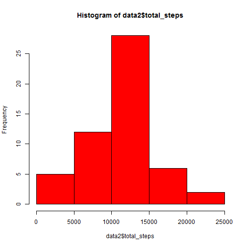
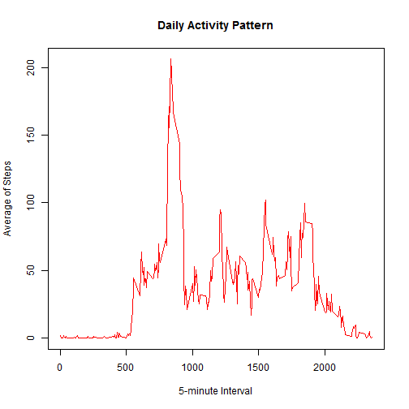
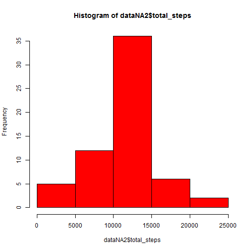
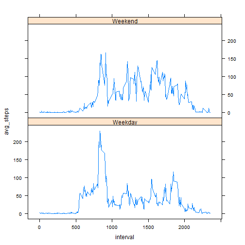

Peer Assesment exercise 1 for coursera MOOC "Reproducible Research" in the specialization "Data Science"


## Loading and preprocessing the data

First, being the working directory set where the [repo's files are](https://github.com/rdpeng/RepData_PeerAssessment1), we unzip, read the data and load the necessary packages.

```r
unzip("activity.zip")
data <- read.csv("activity.csv")
library(lattice)
library(plyr)
library(dplyr)
```

## What is mean total number of steps taken per day?

Now, we plot the total number of steps per day and get the mean and median from this total.


```r
data2 <- group_by(data, date) %>%
        filter(!is.na(steps)) %>%
        summarise(total_steps = sum(steps))
hist(data2$total_steps, col="red")
```

 

```r
mean(data2$total_steps, na.rm=TRUE)
```

```
## [1] 10766.19
```

```r
median(data2$total_steps, na.rm=TRUE)
```

```
## [1] 10765
```


## What is the average daily activity pattern?

For this part, we first make a data frame with the average steps per day 5-minute interval and then plot the averages by corresponding intervals:


```r
data3 <- group_by(data, interval) %>%
        filter(!is.na(steps)) %>%
        summarise(avg_steps = mean(steps))
plot(data3$interval, data3$avg_steps
     , type="l", col="red"
     , main="Daily Activity Pattern"
     , xlab="5-minute Interval", ylab="Average of Steps")
```

 

And now we see which interval has the maximun number of steps on average across all days:


```r
data3[which.max(data3$avg_steps), 1]
```

```
## Source: local data frame [1 x 1]
## 
##   interval
## 1      835
```


## Imputing missing values

We see first how many NAs there are in steps variable of the dataset.


```r
sum(is.na(data$steps))
```

```
## [1] 2304
```

In order to keep the daily pattern tendencies, we will use the interval mean across all days for filling the NA cases.


```r
impute.mean <- function(x) replace(x, is.na(x), mean(x, na.rm = TRUE))
dataNA <- ddply(data, ~ interval, transform, steps = impute.mean(steps))
dataNA <- dataNA[order(dataNA$date), ]
```

Now, we make a histogram of the total number of steps for each day with the imputed data. Also, we calculate the mean and median for the total number of steps.


```r
dataNA2 <- group_by(dataNA, date) %>%
        summarise(total_steps = sum(steps))
hist(dataNA2$total_steps, col="red")
```

 

```r
mean(dataNA2$total_steps)
```

```
## [1] 10766.19
```

```r
median(dataNA2$total_steps)
```

```
## [1] 10766.19
```

As we can see, the mean and median equal the mean for the dataset without NAs. The median for the first dataset, i.e. without imputing the NAs, is slightly lower. As result, we observe that there is no major impact for imputing the steps interval means to the corresponding NAs.


## Are there differences in activity patterns between weekdays and weekends?

Now we plot the daily activity patterns with the imputed NAs for weekdays and weekend days.


```r
Sys.setlocale("LC_TIME", "English")
```

```
## [1] "English_United States.1252"
```

```r
dataNA$date <- as.character(dataNA$date)
dataNA$date <- as.Date(dataNA$date)

datadays <- mutate(dataNA, weekdays = weekdays(dataNA$date))
datadays$weekdays2[datadays$weekdays=="Monday"] <- "Weekday"
datadays$weekdays2[datadays$weekdays=="Tuesday"] <- "Weekday"
datadays$weekdays2[datadays$weekdays=="Wednesday"] <- "Weekday"
datadays$weekdays2[datadays$weekdays=="Thursday"] <- "Weekday"
datadays$weekdays2[datadays$weekdays=="Friday"] <- "Weekday"

datadays$weekdays2[datadays$weekdays=="Saturday"] <- "Weekend"
datadays$weekdays2[datadays$weekdays=="Sunday"] <- "Weekend"

datadays$weekdays2 <- as.factor(datadays$weekdays2)

datadays2 <- group_by(datadays, interval, weekdays2) %>%
        summarise(avg_steps = mean(steps))
xyplot(avg_steps ~ interval | weekdays2, data = datadays2, layout = c(1,2), type="l")
```

 

As it can be seen, there are no evident differences after the imputing of mean in the activity patter. Obviously, this is a consequence of the imputing strategy, because we used the interval mean for the impute.

Besides, there are different tendencies between weekdays and weekdends. In the last ones, there tends to be less steps on average for the intervals, and they are taken later on the day. In weekdays there are more steps on average for the intervals and they are made sooner in the day.
